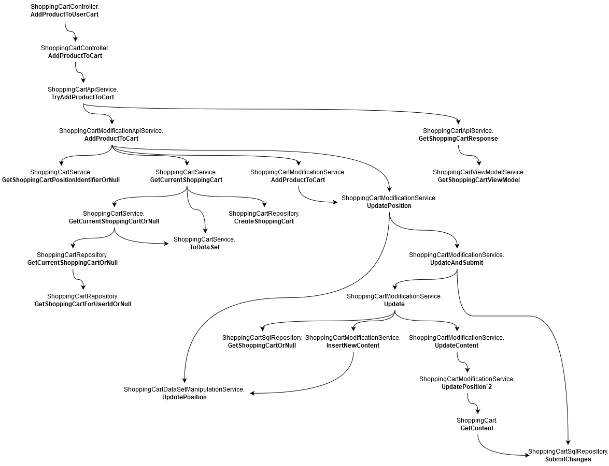
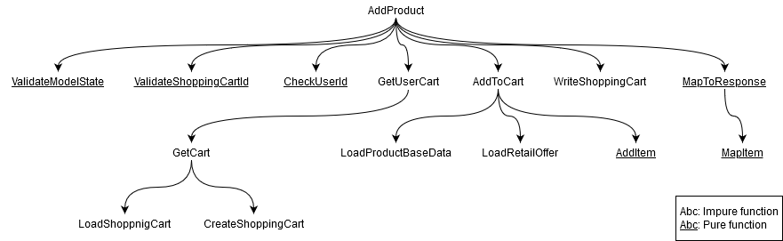

# Part 2: Samuels lab

## tl;dr
In my lab I wanted to see how we could implement core principles of functional programming in our
monolith code base while still using C# and what benefits and drawbacks that brings with it. I
rebuilt a subset of the functionality of the "get feature toggles" and the "post shopping cart item"
APIs. For that I used the existing `Chabis.Functional` library. I could achieve all my goals without
much effort. In my oppinion the code I wrote using a functional approach is more concise, more
readable, points to the underlying business rules more clearly and is easier to test than the code
currently in production.

## My approach
My goal was to highlight key benefits and disadvantages of software design used in both Object 
Oriented Programming (OOP) and Functional Programming (FP). I aimed to find advantages and 
disadvantages in both approaches. In order to see and understand these differences I wanted to 
(at least partly) rebuild a rather well known functionality in the existing devinite code base. I 
chose to imitate two rest APIs: The "get featuretoggle" API and the "post shopping cart item" API. 
While the first API turned out to be a perfect starting point due to its simplicity the second one 
comes with a lot more requirements and therefore challenges for code design. Unfortunately I was not 
able to build an exact replica of both APIs due to the time limit. However, in my oppinion the
selected feature set for both endpoints represent challenging real world examples which allow for 
comparing the production code written with OOP in mind with my FP approach.

When shaping my design for the code I especially followed the following principles:

1. The amount of pure functions, i.e. funcitons that only depend on its input variables and do not 
trigger any side effects, should be maximized. This leads to code that is easier to understand and 
to test, as Mark Seeman pointed out in his talk about functional design [1].
2. Mutable state should be avoided fully since it can quickly lead to convoluted and thus overly 
complex code.
3. Data and functions are to be strictly separated. This is of course a core principle of 
functional programming.

Because I did not want to start from scratch I used the existing `Chaibs.Functional` library [2]. This 
library provides Types for optional values, results, and more.

## Scenario 1: GET feature toggles
I rebuilt the following functionality of the "get feature toggles" APi:

1. Retrieve the data for the requested feature toggle from a data source
2. Check, if the feature toggle is currently active for the provided user
3. Map the data to the response model
4. Return a 200 status code for existing feature toggles
5. Return a 404 (not found) status code if the requested feature toggle does not exist

## Scenario 2: POST shopping cart item
For the more complicated example I selected the "post shopping cart item" API and implemented the 
following functionality:

1. Validate user rights: Only logged in users can access this endpoint and users might only acces 
their own shopping cart
2. Validate the request itself: The requested shopping cart must have id 0 (since there is only one 
cart per user as of now) and the post body must contain a valid request
3. Load the current cart from a data source
4. Apeend the item from the request to the existing cart using product data from two additional data 
sources. If the requested item is already in the cart, only the quantity should be increased.
5. Persist the modified cart
6. Return the new cart state
7. Respond with an appropriate error status when necessary

## Analysis
I organized my namespaces in a similar way as it is done in our devinite solution. This should lead 
to some familiarity and to better comperabilty.

While the repositories in the devinite solution are most often hidden I use functions loading data 
from a "database" directly in the controller. It is important to note that my load functions return 
a domain model and not database entities. This causes the business logic to consist of only pure 
functions which allows for more flexibility when composing the functions.

I use the automatic dependency resolution provided by the integrated di mechanism of dotent core, 
but only in the controllers. Injecting my data access functions allows me to provide different 
functions for testing the controllers so that I don't have to rely on any database. In an MVC 
project this approach works well because we need a class for the controller anyway.

Revisiting the three goals I set for myself I would argue that I reached all of them. Most of my 
functions I could keep pure. This made testing them indeed easier. Further, I enabled imutability by
using structs and setting them to *readonly*. This enforces that all members are also declared
*readonly*. For collections I exclusively used the *Readonly* interfaces in conjuntion with the
`AsReadOnly()` method. Of course, it is still easy to forget to use readonly structs or immutable
lists when adding or chaning code. This risk could be mitigated by writing a custom Roslyn analyzer.
The third goal was the easiest to achieve. Unfortunately, C# forces you to place all methods inside
classes. So I declared the classes static and refrained from using static state (except for my
"in-memory database" classes).

The following two illustration shows the methods of the devinite code base that are necessary to 
fulfill the "post shopping cart item" API request and the dependencies between the methods:

Now compare this with the same illustration of my approach:

I acknowledge that this comparison is somewhat flawed in that the current implementation in the
devinite repository provides more functionality than my version. To keep the comparison as fair
as possible I included only the methods that are required to achieve the same functionality that I 
provide in my example. Having said that, I find it much easier to comprehend what is going on when 
looking at my approach. 

## Learnings

1. Despite the "promises" made by Mark Seeman not everything comes automatically when using the functional 
paradigm. You still need to make sure to highlight important business rules in your code instead of hiding 
it. However, i found it much easier to do so compared to OOP.

2. Thinking in small, self-contained functions seemed to favour the reusability of the code. When I 
added a GET endpoint for the shopping cart API after having implemented the POST endpoint for cart 
items I was able to re-compose the existing functions without needing to write new ones. It would be 
interesting to see, how performance optimization could be encorporated into this design.

3. I strictly separated functions contianing business logic from mapper functions in the "UI layer". 
For instance, the `AddItem(...)` function could have returned `Result<Cart, HttpStatusCode>` directly. 
Because in my scenario this operation cannot fail I opted to always just return a cart and map the 
response in the controller instead. This makes it possible to use the function in other places without 
having to deal with the `HttpStatusCode`.

4. For this lab I heavily relied on the existing `Chabis.Functional` library. This allowed me to write 
well structured and easy to read code quickly. Common complexities are abtracted in the `Option` and 
`Result` classes. In my experience, whithout this complexity the self-written code tends to be much 
simpler and therefor better suited for reusing it.

5. Testing the functional code was super easy. I avoided state and made as many methods as possible pure. 
This gave me great flexibilty when writing the test.

6. Testing a controller is still not trivial. By separating the code in a sensible way it is possible, 
though.

7. Although I clearly see its benefits the mapping of data structures in C# was still tedious. 
Unfortunately there is no spread operator like in JavaScript and the type system requires the 
programmer to specify almost everything explicitly. Switching to F# for example would have made this 
significantly easier.

## Conclusion
In my oppinion it can be highly beneficial to borrow concepts from the functional world even when working 
in C#. Immutability and the idea of pure functions tend to make the code much easier to understand and 
therefor easier to expand and to fix. The benefit of increased testability should also lead to more stable 
code. If you are free from constraints and decide to use the functional paradigm fully in a 
 project, I would recommend to look into using a functional programming language instead. Even though C# 
 could be labelled as a multi-paradigm language it contians many obstacles and inconveniences when following 
 a functional approach.

## Comparison to Lukes approach
While I focused on the feasibility of using functional principles in our existing code base, Luke 
investigated the capabilites of C# and how the language could facilitate his desired design that 
uses function composition / pipelines. I think my findings could find its way more quickly into our 
productive code base because it requires less change in the way we write code while Lukes result 
might influence the design of our software more in the long run since his approach is fundamentally 
different from our current thinking. I have to admit, though, that I still dont understand its 
benefits and drawbacks fully. Something I am sure will change during future discussion and 
experimentation.

## The future of the lab
Now that the lab is completed I would like to discuss your opinion on that matter. Where do you see benefits 
and disadvantages of functional programming? Do you know an interesting use case for the comparison between 
FP and OOP I did not include? Du you have any questions I might be able to answer? Please do reach out on MS 
Teams or via email (samuel.bittmann@digitecgalaxus.ch). I'd be more than happy to discuss this topic over a coffee.

## References / further "reading"
[1] Mark Seemann, "Functional architecture - The pits of success", https://youtu.be/US8QG9I1XW0: 
Talk about the intrinsic benefits of functional programming compared to object oriented programming.

[2] Chabis.Functional library, https://dev.azure.com/digitecgalaxus/devinite/_git/Chabis.Functional

[3] Mark Seemann, "From desgin patterns to category theory", 
https://blog.ploeh.dk/2017/10/04/from-design-patterns-to-category-theory/: Blog post series 
dedicated to teach the fundamentals of category theory for programming.